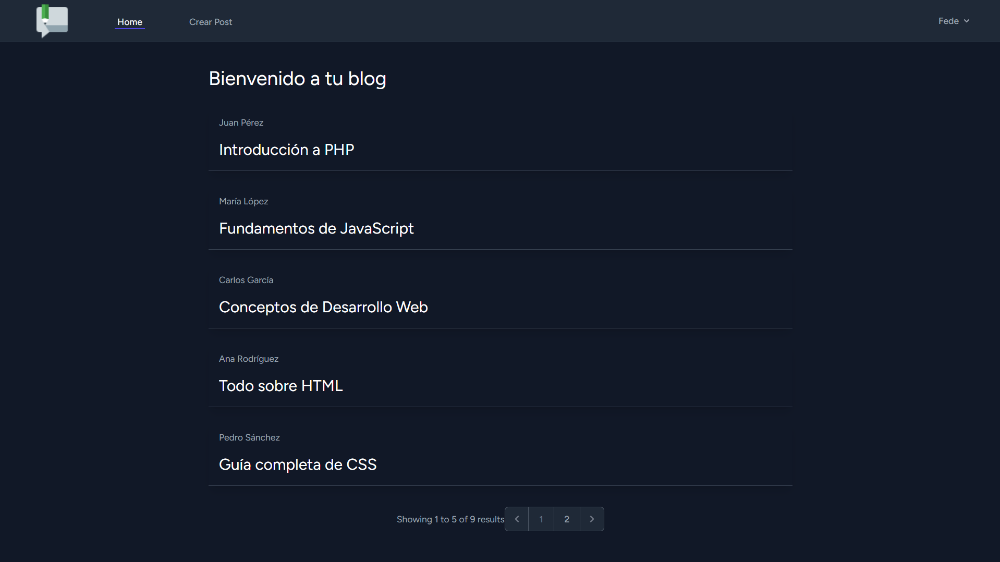
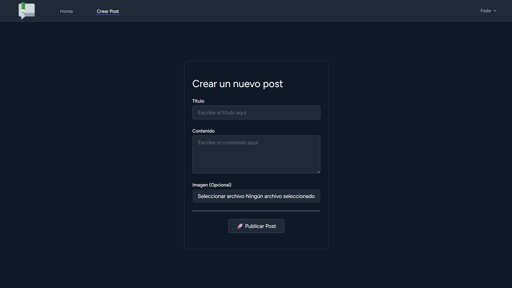
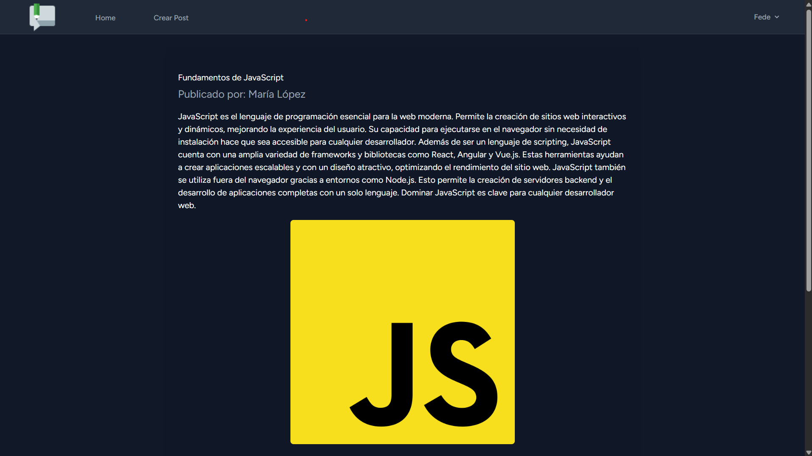
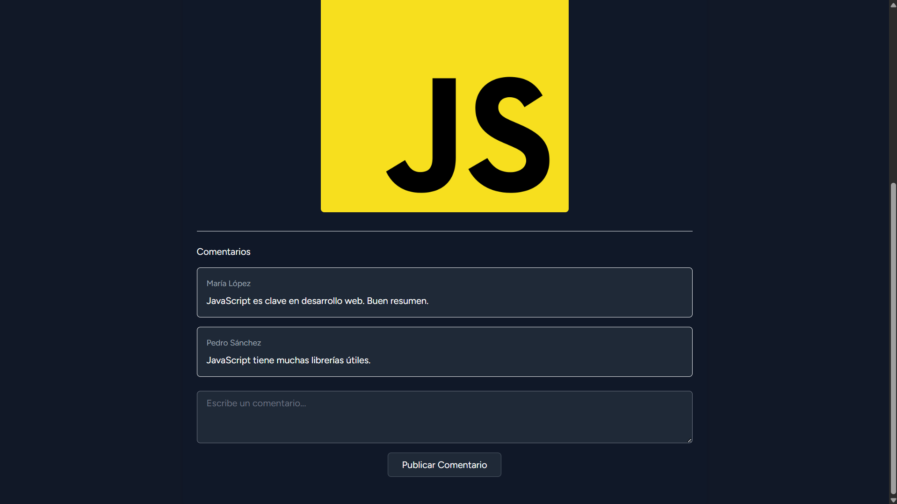
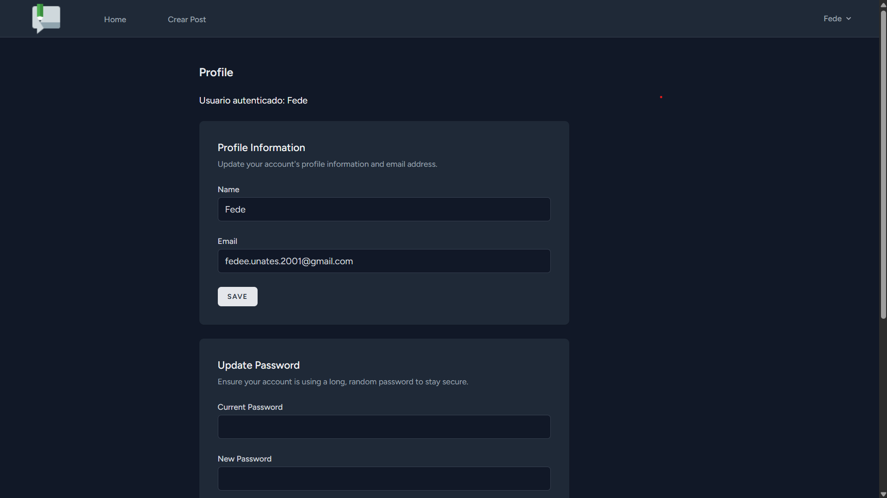

# My Blog

```php
$alumno = [
  'nombre'=> 'Federico Uñates',
  'legajo'=> 'FAI-4988',
  'repositorio'=> 'https://github.com/FedeU18/my-blog',
]
```

# 📝 Blog con Laravel, XAMPP y Tailwind

Este proyecto es un **blog dinámico** desarrollado con **Laravel**, utilizando **XAMPP (Apache & MySQL)** como entorno de ejecución. Permite a los usuarios **crear, visualizar y comentar posts**, además de **editar su perfil y gestionar sus propias publicaciones**.

---

## 🚀 Tecnologías Utilizadas

✅ **Laravel** → Framework PHP para estructurar el proyecto en MVC.  
✅ **XAMPP (Apache & MySQL)** → Entorno de servidor y base de datos.  
✅ **Blade** → Motor de plantillas para las vistas en Laravel.  
✅ **Breeze** → Sistema de autenticación y gestión de usuarios.  
✅ **Tailwind CSS** → Estilos modernos y flexibles para la interfaz.  
✅ **ImgBB API** → Almacenamiento de imágenes y gestión de URLs en la base de datos.

---

## 📌 Características

🔹 **Registro e inicio de sesión** con Laravel Breeze.  
🔹 **Creación y edición de posts** con formularios intuitivos.  
🔹 **Interacción con otros usuarios** mediante comentarios.  
🔹 **Gestión de perfil** con opción de edición personalizada.  
🔹 **Vista y edición de publicaciones propias** con control total.  
🔹 **Almacenamiento de imágenes** con ImgBB API, guardando la URL en la base de datos.  
🔹 **Diseño responsive** con Tailwind CSS para una mejor experiencia de usuario.

---

## ⚙️ Instalación

### 1️⃣ Clonar el repositorio

```bash
git clone https://github.com/FedeU18/my-blog
cd my-blog
```

### 2️⃣ Instalar dependencia

```bash
composer install
npm install
```

### 3️⃣ Configurar el archivo .env

```.env
DB_CONNECTION=mysql
DB_HOST=127.0.0.1
DB_PORT=3306
DB_DATABASE=nombre_base_datos
DB_USERNAME=root
DB_PASSWORD=
IMGBB_API_KEY=TU_API_KEY
```

### 4️⃣ Ejecutar migraciones y servidor

```bash
php artisan migrate
php artisan serve
```

## 📷 Gestión de Imágenes con ImgBB

🔹Las imágenes de los posts se suben a ImgBB, y la API devuelve una URL de la imagen que se almacena en la base de datos. Esto permite acceder y mostrar imágenes sin necesidad de almacenamiento local.

## 🎨 Estilos con Tailwind CSS

🔹Este proyecto utiliza Tailwind CSS para personalizar la interfaz. Su sistema de utilidades permite un diseño limpio y optimizado sin necesidad de escribir CSS adicional.

## 📸 Imágenes del Proyecto

### 🔹 **Página de Inicio**

> 

### 🔹 **Creación de un Post**

> 

### 🔹 **Vista de un Post**

> 

### 🔹 **Comentarios en un Post**

> 

### 🔹 **Edición de Perfil**

> 
